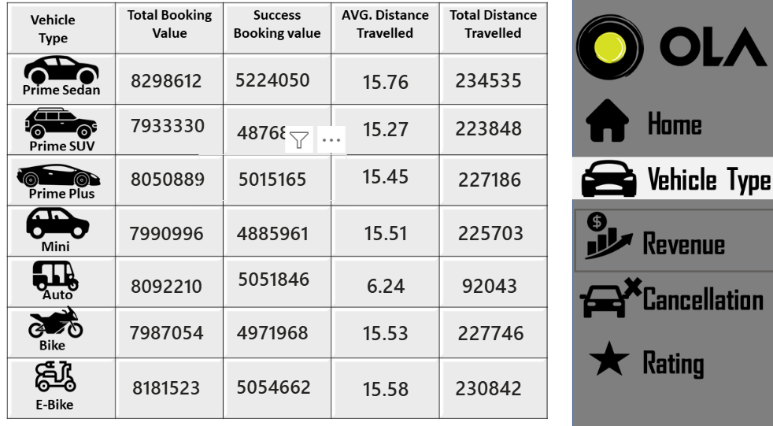
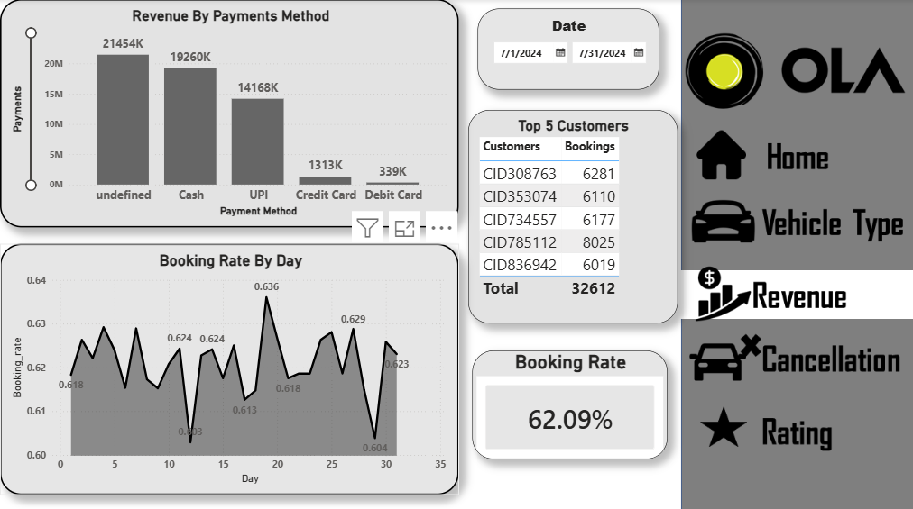

# 🚖 OLA Ride Booking Data Analysis Dashboard (Power BI + SQL)

## 📌 Project Overview
This project presents an end-to-end analysis of OLA ride booking operations using **SQL for data preprocessing** and **Power BI for dashboard visualization**.

The project transforms raw booking data into actionable business insights through data cleaning, data transformation, KPI generation, and interactive reporting.

The analysis focuses on booking trends, ride completion, cancellations, revenue generation, customer behavior, and operational performance.

---

## 🎯 Objectives

- Analyze overall booking performance
- Track ride success and cancellation rates
- Perform data preprocessing using SQL
- Generate business KPIs and insights
- Measure booking revenue and ride trends
- Understand customer and driver behavior
- Create an interactive dashboard for reporting

---

## 🛠️ Tools & Technologies

- **SQL** → Data Cleaning & Preprocessing
- **Power BI** → Dashboard Development
- **CSV Dataset**
- **Data Modeling**
- **DAX Measures**
- **Data Visualization**
- **Exploratory Data Analysis (EDA)**

---

## ⚙️ Data Preprocessing (SQL)

Before creating dashboards in Power BI, data preprocessing was performed using SQL.

### SQL Operations Performed:
- Data extraction and filtering
- Handling missing/null values
- Removing duplicate records
- Data transformation
- Data formatting and cleaning
- Creating calculated columns
- Aggregation and KPI preparation
- Preparing structured data for dashboard analysis

---

## 📂 Dataset Information

The dataset contains OLA ride booking records and includes:

- Booking ID
- Customer ID
- Booking Status
- Vehicle Type
- Pickup Location
- Drop Location
- Ride Distance
- Booking Value
- Payment Method
- Driver Ratings
- Customer Ratings
- Cancellation Reasons

---

## 📊 Key Metrics

| Metric | Value |
|--------|-------|
| Total Bookings | 103,024+ |
| Ride Completion Rate | Dashboard |
| Driver Cancellation Rate | Dashboard |
| Customer Cancellation Rate | Dashboard |
| Revenue Generated | Dashboard |
| Average Ride Distance | Dashboard |

---

## 📈 Dashboard Features

### 🚖 Booking Overview
Monitor overall booking activity and ride performance.

### 💰 Revenue Analysis
Track revenue trends and booking value.

### ❌ Cancellation Analysis
Analyze customer and driver cancellation behavior.

### 🚘 Vehicle Performance
Compare ride performance across vehicle categories.

### ⭐ Customer Experience
Study ratings and customer engagement.

### 📊 KPI Dashboard
Interactive visuals for business decision-making.

---

## 🔍 Business Insights

- Identified ride demand patterns and booking trends
- Measured ride completion efficiency
- Evaluated cancellation impact
- Analyzed customer satisfaction indicators
- Generated business insights using SQL and Power BI

---

## 📁 Project Structure

```plaintext
OLA-Data-Analysis/
│
├── Dataset/
│   └── Bookings.csv
│
├── SQL/
│   └── Data_Preprocessing.sql
│
├── Dashboard/
│   └── ola dashboard.pbix
│
├── Images/
│
└── README.md
```

---

## 📷 Dashboard Preview

## Home Page


## Vechical Type


## Revenue



---

## 💡 Future Improvements

- Add predictive analytics
- Build real-time dashboard
- Add machine learning forecasting
- Create automated ETL pipelines

---

## 👨‍💻 Author

**Avishkar Gurav**  
GitHub: https://github.com/avishkargurav

---

⭐ If you found this project useful, consider giving it a star.
